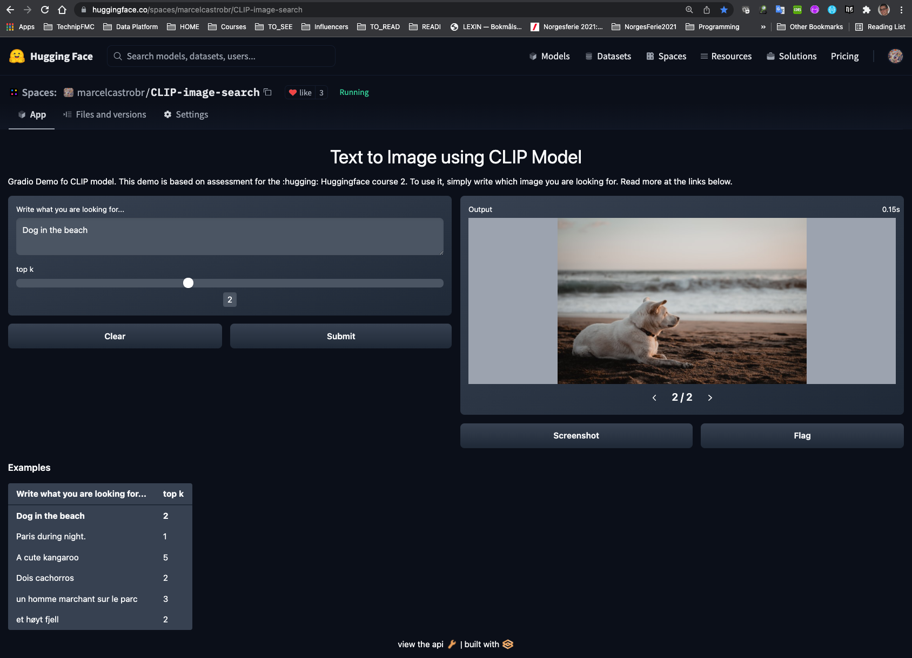

#  [Hugging Face Course: Part 2](https://hf.co/course)

> Objectives: 
>
> Part 2 will focus on all the other common NLP tasks: token classification, language modeling (causal and masked), translation, summarization and question answering. It will also take a deeper dive in the whole Hugging Face ecosystem, in particular [🤗 Datasets](https://github.com/huggingface/datasets) and [🤗 Tokenizers](https://github.com/huggingface/tokenizers).

Course link: https://huggingface.co/course/chapter5?fw=pt

[Amazon SageMaker Community](https://huggingface.co/amazon-sagemaker-community)

# Project Requirements:

**Goal:** Create a **text-to-image search engine** that allows users to search for images based on natural language queries using techniques like [Multilingual Knowledge Distillation 2](https://arxiv.org/abs/2004.09813) to extend the embeddings to new languages.

- [Use OpenAI’s CLIP for image search](https://discuss.huggingface.co/t/use-openais-clip-for-image-search/11577)
- [FAQ about the course projects](https://discuss.huggingface.co/t/faq-about-the-course-projects/11689)

## Example of Models:

Below are some CLIP model examples.

- https://github.com/orpatashnik/StyleCLIP
- https://huggingface.co/openai/clip-vit-base-patch32
- https://www.sbert.net/examples/applications/image-search/README.html#examples

# Course Notebook references:

- [Lab1: Finetuning HuggingFace models with Amazon SageMaker](https://github.com/philschmid/huggingface-sagemaker-workshop-series/blob/main/workshop_1_getting_started_with_amazon_sagemaker/lab_1_default_training.ipynb) 
- [HuggingFace Hub meets Amazon SageMaker](https://github.com/huggingface/notebooks/blob/master/sagemaker/14_train_and_push_to_hub/sagemaker-notebook.ipynb)

# CLIP Model:

- [CLIP Paper](https://arxiv.org/abs/2103.00020)
- [Yannic’s video](https://www.youtube.com/watch?v=T9XSU0pKX2E) 
- [unsplash datase](https://unsplash.com/data)

**CLIP model overview:**

The CLIP model was proposed in [Learning Transferable Visual Models From Natural Language Supervision](https://arxiv.org/abs/2103.00020) by Alec Radford, Jong Wook Kim, Chris Hallacy, Aditya Ramesh, Gabriel Goh, Sandhini Agarwal, Girish Sastry, Amanda Askell, Pamela Mishkin, Jack Clark, Gretchen Krueger, Ilya Sutskever. CLIP (Contrastive Language-Image Pre-Training) is a neural network trained on a variety of (image, text) pairs. It can be instructed in natural language to predict the most relevant text snippet, given an image, without directly optimizing for the task, similarly to the zero-shot capabilities of GPT-2 and 3. Source: [HuggingFace](https://huggingface.co/docs/transformers/model_doc/clip)

# DEMO: Text to Image using CLIP Model

**Short Description**:  I made use of the CLIP Model implemented in the HuggingFace [transformers](https://huggingface.co/docs/transformers/model_doc/clip) library. The [openai/clip-vit-base-patch32](openai/clip-vit-base-patch32) was used as a pertained model using the [unsplash-25k-photos dataset](https://github.com/unsplash/datasets). 

Please check the demo on the link below. You can use the examples in the Botton left corner for ideas on how it works. The demo was build using [Hugging Face Spaces](https://huggingface.co/spaces) and [gradio](https://gradio.app/). 

**Link**: https://huggingface.co/spaces/marcelcastrobr/CLIP-image-search

# Course certificate :satisfied: :white_check_mark:

